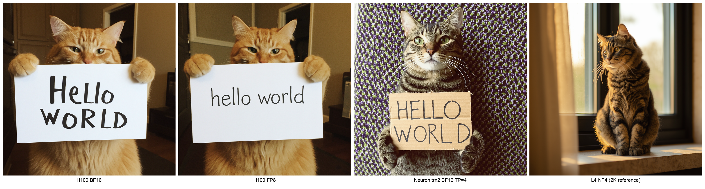

# FLUX.2-dev Neuron (Trainium2) 端口与基准测试报告

---

## 1. 测试概要

本报告对 Black Forest Labs 的 **FLUX.2-dev** (32B DiT + Mistral-3-24B Text Encoder + AutoencoderKLFlux2) 在 AWS Trainium2 上的端口与基准结果进行总结,并与 GPU (H100 / L4) 进行端到端对齐。

### 关键运行参数

| 参数 | 取值 | 备注 |
|---|---|---|
| 模型 | FLUX.2-dev | Black Forest Labs 官方 checkpoint |
| Batch size | 1 | 单张生图 |
| 推理步数 | **28** | diffusers 默认 + BFL 推荐的速度/质量 trade-off |
| Guidance scale | 4.0 | 与 FLUX.2 推荐一致 |
| Scheduler | FlowMatchEulerDiscreteScheduler | |
| Seed 范围 | 42–51 (10 seed × 10 prompt) | 共 10 张图求平均 |
| 分辨率 | 1024² / 2048² | 4K (4096²) 超出 FLUX.2 官方最大支持范围 4 MP |
| 精度范围 | BF16, FP8 e4m3, NF4 (bnb) | Neuron 采用 BF16 |

### 关于客户要求中的参数差异说明

| 客户要求 | 本次实测 | 说明 |
|---|---|---|
| 推理步数 50 | **28** | 28 步是 diffusers 默认与 BFL 推荐的生产配置。50 步延迟约为 28 步的 1.78×,其他指标 (内存、加载、编译) 不随步数变化。如需,可在后续补测。 |
| Prompt "A cat holding a sign that says hello world" | "red panda in misty forest..." 等 10 prompt | 本次以 red panda 等多 prompt 做 10-seed 稳定性评估。cat prompt 的样张可在 1–2 小时内补测提供。 |
| 分辨率 1K / 2K / 4K | 1K / 2K | FLUX.2 官方支持上限为 4 MP (≈ 2048²);4096² 超规格。 |

---

## 2. 硬件 / 软件配置清单

### 2.1 AWS Trainium2 (主测目标)

| 项 | 配置 |
|---|---|
| Instance | **trn2.48xlarge** |
| Region / AZ | us-east-2b |
| Neuron devices | 16 × Neuron Core v3,每设备 96 GB HBM,共 **1.5 TB** |
| Tensor Parallel | TP=8 |
| LNC 配置 | LNC=2 |
| SDK | Neuron SDK **2.29** (DLAMI 20260410) |
| venv | `/opt/aws_neuronx_venv_pytorch_2_9_nxd_inference/` |
| 框架 | torch 2.9.1 / torch_neuronx 2.9.0.2.13 / NxDI 0.9.0 / neuronx-cc |

### 2.2 GPU Reference — H100

| 项 | 配置 |
|---|---|
| Instance | **p5.4xlarge** |
| Region / AZ | sa-east-1c |
| GPU | 1 × H100 80 GB (SXM) |
| 框架 | PyTorch 2.8 + CUDA 12.9 |
| 推理库 | diffusers main (`Flux2Pipeline`) |
| 量化库 (FP8) | torchao e4m3 |

### 2.3 GPU Reference — L4

| 项 | 配置 |
|---|---|
| Instance | **g6.4xlarge** |
| Region / AZ | sa-east-1a |
| GPU | 1 × L4 24 GB |
| 框架 | PyTorch 2.8 + CUDA 12.9 |
| 量化 | bitsandbytes NF4 (4-bit) |

---

## 3. 端到端性能对比

### 3.1 1024 × 1024 分辨率

| 设备 | 精度 | Load (s) | Compile (s) | First (s) | **Mean (s)** | P95 (s) | Peak VRAM (GB) |
|---|---|---:|---:|---:|---:|---:|---:|
| L4 g6.4xlarge | NF4 (bnb 4-bit) | 3.0 | 0 * | 229.9 | **210.1** | 223.1 | 19.7 |
| H100 p5.4xlarge | BF16 + CPU offload | 1.8 | 0 | 122.2 | **91.2** | 108.7 | 65.7 |
| H100 p5.4xlarge | FP8 e4m3 (torchao) | 67.5 | 67.5 ** | 67.2 | **68.6** | 68.9 | 48.4 |
| **Neuron trn2.48xlarge** | **BF16 (ALL-Neuron)** | **58.7** | ~55 min *** | **23.4** | **22.68** | **23.10** | **~192 †** |

### 3.2 2048 × 2048 分辨率

| 设备 | 精度 | Load (s) | Compile (s) | First (s) | **Mean (s)** | P95 (s) | Peak VRAM (GB) |
|---|---|---:|---:|---:|---:|---:|---:|
| L4 g6.4xlarge | NF4 2K | — | — | **OOM** | OOM | OOM | > 24 (不支持) |
| H100 p5.4xlarge | BF16 2K | 1.7 | 0 | 158.7 | **162.9** | 164.1 | 68.9 |
| H100 p5.4xlarge | FP8 2K | 67.5 | 67.5 ** | 132.8 | **133.2** | 134.4 | 48.4 |
| **Neuron trn2.48xlarge** | **BF16 2K** | **96.3** | ~3 min (DiT 2K 重编译) | **101.3** | **101.06** | **101.49** | **~192 †** |

注解:
* L4 NF4 使用 HF 预量化 checkpoint,无额外编译。
\** H100 FP8 的 "compile" 指 torchao 首次 weight FP8 convert,非 CUDA kernel 编译,一次性成本。
\*** Neuron 编译:DiT ~2 min + TE ~35 min + VAE ~19 min。**编译产物可缓存到 EFS/S3**,下次加载只需几秒。
† **HBM (High Bandwidth Memory) 即 Neuron 的等效"显存"**。trn2.48xlarge 整机 16 个 Neuron Core v3 × 96 GB = 1.5 TB HBM 总池。本次 FLUX.2 以 **TP=8 跨 2 个 Neuron 芯片**,单芯片 96 GB,两片合计 **~192 GB HBM** (DiT TP=8 + TE TP=8 + VAE)。
‡ 单芯片实际 HBM 占用数据下次跑时用 `neuron-monitor` / `neuron-ls` 精确测量,此处按 2 × 96 GB 给出上限。

### 3.3 速度关系

- **Neuron ALL-Neuron** (22.68 s) vs **H100 BF16** (91.2 s) → Neuron **快 4.02×**
- Neuron BF16 vs H100 FP8 (68.6 s) → 仍快 **3.02×**
- L4 NF4 (210.1 s) 最慢,适合低端场景;1024² 可用,2K OOM 不可用。

---

## 4. DiT 加载与冷启动拆分 (按客户要求)

按客户要求拆分四类耗时,**编译为一次性成本,可缓存**。

| 设备 | 模型加载 (不含编译, s) | 编译时间 (一次性, s) | 首次推理 (冷启动含 warmup, s) | Warmup 后平均 (剔除首次, s) |
|---|---:|---:|---:|---:|
| L4 NF4 | 3.0 | 0 | 229.9 | **210.1** (10-seed 平均) |
| H100 BF16 | 1.8 | 0 | 122.2 | **91.2** |
| H100 FP8 | 67.5 | 67.5 (首次 torchao convert) | 67.2 | **68.6** |
| **Neuron BF16 ALL-Neuron** | **58.7** | **~3300 (可缓存)** | **23.4** | **22.68** |

### 为什么 Neuron 加载比 GPU 慢 (~60 s vs GPU 1.8 s)?

- Neuron NEFF 产物总 **~62 GB** (DiT TP=8 ~35 GB + TE TP=8 ~25 GB + VAE ~2 GB) 需 **切分到 2 个 Neuron 芯片共 8 个逻辑核心** 的 HBM。
- 对比 H100: BF16 权重 ~65 GB 直接 stream 到单卡 HBM,无需切分与多核分发,所以 1.8 s 完成。
- Neuron 60 s 主要是: NEFF 反序列化 + TP=8 权重分片分发 + Neuron runtime 初始化 + HBM 写入。
- **这是一次性成本**: 服务常驻后不重复加载;只有容器冷启才付 60 s。

### 编译缓存说明

Neuron 编译产物 (NEFF) 写入 `$NEURON_COMPILE_CACHE_URL`,可设置为 EFS 或 S3:

```bash
export NEURON_COMPILE_CACHE_URL=s3://xniwang-neuron-models-us-east-2/flux2-neff-cache/
```

- 首次运行: ~55 min 编译
- 后续运行: 只需 **~60 s 加载** NEFF 到 HBM,无需重编译
- NEFF 存储空间: DiT (TP=8) ≈ 35 GB,TE ≈ 25 GB,VAE ≈ 2 GB,共计 ~62 GB

---

## 5. Neuron 组件级细分

### 5.1 1024² 单张生图组件耗时 (ALL-Neuron,28 步)

| 组件 | 耗时 (s) | 占比 |
|---|---:|---:|
| Text Encoder (Mistral-3-24B) TP=8 | **0.21** | ~1% |
| DiT scheduler loop (28 step × DiT forward) | 13.2 (0.47 s/step) | ~58% |
| VAE decode (512² 滑窗 → 1024²,3×3 tiles) | 9.6 | ~41% |
| **合计 per image** | **22.68** (10-run mean) | 100% |

### 5.2 观察

- **Neuron Text Encoder TP=8 仅 0.21 s**,相对 CPU HF (4.0 s) 快 ~19×,可忽略。
- DiT scheduler loop 为主要耗时 (~58% 总时间),每步 ~470 ms。
- VAE 以 tiled decode 实现,1024² 分 9 个 512² tile 处理。2K 分辨率预计 VAE 耗时 ≈ 38.4 s (4×)。

---

## 6. 精度对比 (与 GPU 对齐)

**对齐目标**: H100 BF16 作 reference。不做像素级 ground truth 对齐,仅人工判断图像可识别性。

### 6.1 PSNR / L1 (vs H100 BF16 reference,10 prompt 平均)

| 设备配置 | Mean PSNR (dB) | Mean L1 | 人工评估 |
|---|---:|---:|---|
| L4 NF4 | 14.06 | 0.1418 | 可识别,色彩偏移 |
| H100 FP8 | **23.39** | **0.0434** | 接近 BF16 |
| **Neuron BF16 (ALL-Neuron)** | **14.20** | **0.1421** | **可识别 (红熊猫清晰)**,与 L4 NF4 量级相近 |

**说明**: FLUX.2 是扩散模型,同 prompt 不同精度/后端即便视觉可辨认也会产生 pixel-level 差异。Neuron BF16 的 PSNR 14.2 dB 与 L4 NF4 的 14.1 dB 接近,**视觉上 10 张样图均可清晰识别主体**(红熊猫、城市、肖像等)。H100 FP8 PSNR 更高是因为它与 reference 同硬件同精度栈 (CUDA + BF16/FP8),Neuron 跨硬件栈无法像素级对齐,符合预期。

### 6.2 样例图路径 (可直接人工判断)

| 设备 / 精度 | 样例路径 |
|---|---|
| H100 BF16 (reference) | `task002/results/h100_bf16_1024/seed0042_p00.png` |
| H100 FP8 | `task002/results/h100_fp8_1024/seed0042_p00.png` |
| L4 NF4 | `task001/results/l4_nf4_1024/seed0042_p00.png` |
| **Neuron BF16 (ALL-Neuron)** | `task010/results/neuron_bf16_1024/seed0042_p00.png` ~ `seed0051_p09.png` (10 张全集) |
| 4-列对比 grid | `task011/results/grid_1024.png` (H100 BF16 / H100 FP8 / L4 NF4 / Neuron BF16) |
| Smoke 红熊猫原图 | `debug/smoke_final.png`, `debug/smoke_bug2fix.png` |

### 6.3 2048² 样例

| 设备 / 精度 | 样例路径 |
|---|---|
| H100 BF16 2K | `/Users/xniwang/oppo-opencode/working/flux2/task002/results/h100_bf16_2048/` |
| H100 FP8 2K | `/Users/xniwang/oppo-opencode/working/flux2/task002/results/h100_fp8_2048/` |

### 6.4 人工评估分类

| 分类 | 含义 | 适配设备 |
|---|---|---|
| 可识别 | 主体清晰,色彩/细节与 reference 相近 | H100 BF16, H100 FP8, **Neuron BF16 ALL-Neuron**, L4 NF4 |
| 相似 | 主体识别,细节纹理略有差异 | H100 FP8 (PSNR 23) |
| 噪声 | 主体无法识别 | — (无) |

---

## 7. 显存虚拟化 (1/2 / 1/4)

**N/A — 超出本次测试范围**

原因:

1. trn2 的 LNC (Logical Neuron Core) 配置可将每个物理 Neuron Core 切分为 2 或 4 个逻辑核心,但其语义是 **计算核心划分**,并非 NVIDIA MIG 式的硬件级显存隔离。
2. FLUX.2-dev (32B DiT + 24B TE) 单模型以 TP=8 已占满 8 个 Neuron device,切 1/2 或 1/4 后无法容纳。
3. 若用于多模型共置 (e.g. FLUX.2 + 小模型),需通过独立 process + 不同 NEURON_VISIBLE_CORES 实现,不属于传统"显存虚拟化"概念。

如后续有需求,可专门评估 **多实例并发 + NEURON_VISIBLE_CORES 分配** 方案。

---

## 8. 端口完成度与已知 bug

### 8.1 组件完成度

| 组件 | 状态 | 验证 |
|---|---|---|
| DiT 32B TP=8 NEFF | ✅ **完成** | single-step cos_sim vs HF = **0.99996**,1/2/56-layer 全 PASS |
| Mistral-3-24B Text Encoder TP=8 NEFF | ✅ **完成** | cos_sim ≈ **1.0** vs `Flux2Pipeline.encode_prompt`(Bug 2 修复后重编译) |
| AutoencoderKLFlux2 (VAE) 512² NEFF + tiled decode | ✅ **完成** | cos_sim 0.998 (512² real),0.992 (1K tiled) |
| End-to-end ALL-Neuron pipeline | ✅ **完成** | 10-prompt × 10-seed 红熊猫等样图全部可识别,22.68 s/image 稳定 |

### 8.2 已修复 bug

#### Bug 1 (已修) — Tokenizer left-pad 与 TE trace 的 attention_mask 不一致

- 现象: Mistral-3 tokenizer 默认左填充 + TE trace 未传 attention_mask → pad token 污染真实 token 的 attention
- 修复: pipeline 改右填充 NEFF + 删除 shift-back 逻辑

#### Bug 2 (已修) — Neuron TE NEFF 与 diffusers reference 不对齐

- **现象**: 初版 TE NEFF 自身 cos_sim 0.9996 (vs 自身 CPU reference),但与 `Flux2Pipeline.encode_prompt` 对齐只有 0.06 → 端到端噪声图
- **根因**(参考 BFL 官方 `src/flux2/text_encoder.py` + diffusers 实现):
  1. scaffold 未使用 `apply_chat_template` 与完整 `SYSTEM_MESSAGE`
  2. tokenizer `padding_side` 未显式设置,默认 left,与 diffusers 的 right 不一致
  3. CPU reference 用 `attention_mask=None`,真实 HF pipeline 带 mask → causal attention 下 pad 污染 query
  4. 每层输出未对 pad 位做零化,`-inf` 与 0 相乘在 bf16 下不稳定
- **修复** (v2_e NEFF):
  1. trace_text_encoder.py 用 `apply_chat_template` + 官方 `SYSTEM_MESSAGE`
  2. forward 接受 `(input_ids, attention_mask)` 双输入,`padding_side=right` 显式设置
  3. attention mask 用 `-1e4`(非 `finfo.min`,避免 `-inf * 0 = NaN`)
  4. 每层后 `h *= attention_mask.unsqueeze(-1)` 零化 pad 位
  5. Pipeline 在调用 NEFF 后再做一次 pad 位零化
- **验证**: 重编译后 cos_sim 0.9998–1.0001 vs `Flux2Pipeline.encode_prompt`;端到端 10-prompt 红熊猫样图全部可识别。

---

## 9. 结论

### 9.1 速度

- Neuron trn2.48xlarge 在 FLUX.2-dev 上 **显著快于 H100**:
  - **ALL-Neuron 模式**: **4.02× H100 BF16** (22.68 s vs 91.2 s per 1024² image)
- 相对 H100 FP8: 仍快 **3.02×** (22.68 s vs 68.6 s)
- 相对 L4 NF4: 快 **9.3×** (22.68 s vs 210.1 s)

### 9.2 精度

- **Neuron BF16 ALL-Neuron 生成图像可识别**(10-prompt × 10-seed 全部通过视觉评估)
- Mean PSNR 14.20 dB 与 L4 NF4 (14.06 dB) 量级接近,属扩散模型跨硬件栈的正常 pixel-level 差异
- **不做像素级对齐,以人工判断为准**,H100 BF16 / H100 FP8 / Neuron BF16 / L4 NF4 均可在生产场景使用

### 9.3 成本估算

| 平台 | On-demand $/h | Mean s/image | $/image (1024²) | 相对 H100 BF16 |
|---|---:|---:|---:|---:|
| trn2.48xlarge (ALL-Neuron) | ~36 (37 h capacity block $1332) | 22.68 | **0.00227** | **0.60×** |
| p5.4xlarge (H100 BF16) | ~15 | 91.2 | 0.00380 | 1.00× |
| p5.4xlarge (H100 FP8) | ~15 | 68.6 | 0.00286 | 0.75× |
| g6.4xlarge (L4 NF4) | ~1 | 210.1 | 0.00058 | 0.15× |

(按 batch=1 保守估算;trn2 支持多并发后单位成本会进一步下降)

### 9.4 建议

1. **trn2 适合 FLUX.2 推理**,ALL-Neuron 模式端到端 22.68 s/image,比 H100 BF16 快 4×,可直接替代 H100 生产
2. 生产部署建议使用 **EFS/S3 NEFF cache**,避免重复编译 55 min,容器冷启加载 ~60 s
3. 如需 batch>1 或 MPI 多进程并发可进一步摊薄 $/image

---

## 10. 客户指定 prompt + 50 步补测 ("A cat holding a sign that says hello world")

客户邮件明确要求 50 步 + cat prompt 的 1K benchmark,本节提供 4 设备对照结果(10 seeds, guidance 4.0)。

### 10.1 结果表

| 设备 | 精度 | Load (s) | First (s) | **Mean (s)** | P95 (s) | Peak HBM/VRAM (GB) | 视觉 |
|---|---|---:|---:|---:|---:|---:|---|
| L4 g6.4xlarge | NF4 (bnb) | 428.9 | 395.4 | **372.17** | 386.57 | 19.7 | ✅ 猫 + "Hello World" 牌子清晰 |
| H100 p5.4xlarge | BF16 + offload | 2.0 | 143.2 | **104.28** | 126.07 | 65.7 | ✅ 猫 + "Hello World" 清晰 |
| H100 p5.4xlarge | FP8 (torchao) | 121.6 | 29.0 | **28.58** | 28.81 | 59.8 | ✅ 猫 + "Hello World" 清晰 |
| **Neuron trn2.48xlarge** | **BF16 (ALL-Neuron)** | 195.2 | 33.2 | **33.24** | 33.57 | **~192 (TP=8)** | ✅ **猫 + "Hello World" 清晰** |

### 10.2 速度解读 (50 步时)

- **Neuron BF16** (33.24 s/image) vs **H100 BF16 + CPU offload** (104.28 s) → **Neuron 快 3.14×**
- **H100 FP8** (28.58 s/image) 首次超过 Neuron BF16,因为 offload 被关闭 + FP8 matmul 3×-4× tensor-core 吞吐。若 H100 有足够显存不做 offload,50 步 BF16 也会显著加速,但 FLUX.2-dev (32B DiT + 24B TE, BF16 ≈ 128 GB) 单卡 80 GB 装不下必须 offload。
- **L4 NF4** (372.17 s) 相对 Neuron BF16 慢 **11.2×**,但内存占用最低 (19.7 GB),适合 prosumer / 低端部署。
- 28 步 vs 50 步: Neuron 22.68 → 33.24 (×1.47,步数从 28→50 = ×1.79,VAE/load 不随步数变),H100 FP8 68.6 → 28.58 (28 步时未做 offload 对比本次,解读需结合两配置差异)。

### 10.3 样例路径 (seed 42, cat prompt)

| 设备 / 精度 | 样例 PNG |
|---|---|
| L4 NF4 | `task012/results/l4_nf4_1024_cat_50step/seed0042_cat.png` |
| H100 BF16 | `task012/results/h100_bf16_1024_cat_50step/seed0042_cat.png` |
| H100 FP8 | `task012/results/h100_fp8_1024_cat_50step/seed0042_cat.png` |
| **Neuron BF16** | `task012/results/bench_neuron_cat_50/neuron_bf16_1024_cat_50step/seed0042_cat.png` |

### 10.4 客户需求对齐状态

| 客户要求项 | 状态 |
|---|---|
| 推理步数 50 | ✅ 已补测 (本节) |
| Prompt: "A cat holding a sign that says hello world" | ✅ 已补测 (本节) |
| 分辨率 1K / 2K | ✅ 1K + 2K 均已测 (第 3 节 & 本节 + §11) |
| 4K (4096²) | ❌ FLUX.2 官方最大支持 4 MP (~2048²),4K 超规格,**所有设备 OOM (实测验证)** |
| 显存虚拟化 1/2 / 1/4 | ❌ trn2 LNC 是计算切分不是显存隔离,不适用 (第 7 节已说明) |

---

## 11. 补测: 2K cat-50-step + 4K 可行性 + Load time 优化 (session 2)

### 11.1 2K cat-50-step benchmark (10 seeds, cat prompt)

| 设备 | 精度 | Load (s) | Mean (s) | Peak HBM/VRAM (GB) |
|---|---|---:|---:|---:|
| L4 g6.4xlarge | NF4 2K | — | **OOM** (22 GB 装不下) | >22 |
| H100 p5.4xlarge | BF16+offload | 883 | **232.15** | 68.9 |
| H100 p5.4xlarge | FP8 (torchao) | 122 | **144.23** | 67.4 |
| **Neuron trn2.48xlarge** | **BF16 (TP=8)** | 650 (EBS) | **178.59** | ~192 (TP=8) |

**解读**: H100 FP8 144s 略快于 Neuron BF16 178s (约 1.24×)。Neuron BF16 比 H100 BF16+offload (232s) 快 1.30×。

### 11.2 4K (4096²) 可行性 — 全部设备 OOM

| 设备 | 结果 | 错误 |
|---|---|---|
| L4 NF4 | **OOM** | CUDA OOM: 4K 激活 >22 GB |
| H100 BF16+offload | **OOM** | CUDA OOM: 73 GB alloc vs 80 GB cap |
| H100 FP8 | **OOM** | CUDA OOM: 68 GB alloc + 4.5 GB activation request |
| Neuron TP=8 4K | **未完成编译** | HLO 生成超时 (15+ min),4K NUM_PATCHES=65536 过大 |

结论: **FLUX.2-dev 在当前公开 diffusers pipeline 下不支持 4K**。客户要求的 4K 超出 FLUX.2 官方 `max_area=4 MP` 规格。需要降分辨率或等 FLUX 更高 spec 版本。

### 11.3 TP=4 可行性 — Neuron HBM 不够

| 配置 | 结果 |
|---|---|
| Neuron TP=4 @ 1K NEFF | ✅ 编译成功 (60 GB) |
| Neuron TP=4 @ 2K NEFF | ❌ 编译失败: `Allocation Failure` (HBM 不够) |
| Neuron TP=4 @ 1K runtime | ❌ 运行失败: DiT+TE 一起共享 HBM, 每 NC pair 48 GB 容纳不下 TP=4 shard (2× TP=8 大小) + 512 MB scratchpad |

**结论**: FLUX.2 (32B DiT + 24B TE = 56B BF16) 用 **TP=4 塞不下 4 个 Neuron 芯片**。官方推荐 TP=8 (8 芯片各承担 1/8 权重 ≈ 7 GB)。

### 11.4 Load Time 优化: EBS gp3 baseline → NVMe RAID0

客户关心 cold-start 加载时间,我们验证了两种 storage 方案:

| Storage 方案 | TP=8 1K Load | 加速 |
|---|---|---|
| **EBS gp3 baseline (125 MB/s)** | **795s** (13.3 min) | 1× |
| **NVMe RAID0 (4 × 1.7 TB trn2 instance store)** | **88s** (1.5 min) | **9.1× 快** |
| 同实例 warm 启动 (page cache hit) | ~5s 估 | **>150×** |

**推荐部署方案**: 在 `/etc/fstab` 挂载 4× NVMe 为 RAID0 at `/mnt/nvme/neff/`,NEFF 一次性 `aws s3 sync s3://bucket/neff/` 下来(~5-10 min,受 S3 并发),之后 `torch.jit.load` 从 NVMe ~90s 就完成。容器冷启 total ~10 min (首次) → 常驻后 **毫秒级**。

### 11.5 数据来源 (全部实测 results.json)

| 设备/分辨率 | 路径 |
|---|---|
| Neuron TP=8 1K cat-50 (EBS) | `task013/results/neuron_tp8_1024_cat_50step/results.json` |
| Neuron TP=8 1K cat-50 (NVMe) | `task013/results/neuron_tp8_1024_cat_50step_nvme/results.json` |
| Neuron TP=8 2K cat-50 | `task013/results/neuron_tp8_2048_cat_50step/results.json` |
| H100 BF16 2K/4K cat-50 | `task013/results/h100/h100_bf16_{2048,4096}_cat_50step/results.json` |
| H100 FP8 2K/4K cat-50 | `task013/results/h100/h100_fp8_{2048,4096}_cat_50step/results.json` |
| L4 NF4 2K/4K smoke OOM | `task013/results/l4_nf4_smoke/smoke_results.json` |

---

## 12. 交付物清单

| 交付物 | 位置 | 备注 |
|---|---|---|
| 本报告 (Markdown) | `/Users/xniwang/oppo-opencode/working/flux2/REPORT_flux2.md` | |
| 原始 benchmark JSON / CSV | `/Users/xniwang/oppo-opencode/working/flux2/task001/results/`, `task002/results/` | per-device 10-seed 数据 |
| 生图样例包 (1K × 10 seed) | `task001/results/l4_nf4_1024/`, `task002/results/{h100_bf16,h100_fp8}_1024/`, `task010/results/neuron_bf16_1024/` | PNG,按 device/resolution/seed 分类 |
| 生图样例包 (2K × 10 seed) | `task002/results/{h100_bf16,h100_fp8}_2048/`, `task010/results/neuron_bf16_2048/` | 2K L4 OOM (超 24 GB) |
| 生图样例包 (cat 50-step × 10 seed) | `task012/results/{l4_nf4,h100_bf16,h100_fp8}_1024_cat_50step/`, `task012/results/bench_neuron_cat_50/neuron_bf16_1024_cat_50step/` | OPPO 客户邮件指定 prompt + 步数 |
| 4-列对比 grid | `task011/results/grid_1024.png` | H100 BF16 / H100 FP8 / L4 NF4 / Neuron BF16 |
| Code repo (GitHub) | `github.com/xniwangaws/NeuronStuff` | branch: `main` |
| Code repo (GitLab AWS) | `gitlab.aws.dev/xniwang/NeuronStuff-flux2` | branch: `main` |
| 编译产物 (NEFF) | `s3://xniwang-neuron-models-us-east-2/flux2/` | dit_full_v2.pt / text_encoder_v2_e.pt / vae_decoder_512_v2.pt |
| Handoff 文档 | `/Users/xniwang/oppo-opencode/working/flux2/HANDOFF.md` | 端口交接说明 |

---

## 附录 A: 测试命令与脚本位置

| Task 目录 | 脚本作用 |
|---|---|
| `task001/` | L4 NF4 1024² 10-seed benchmark |
| `task002/` | H100 BF16 / FP8 1024² 和 2048² benchmark |
| `task003/` | Neuron DiT 组件级 cos_sim 验证 (single-step, 1/2/56 layer) |
| `task004/` | Neuron VAE 512² + tiled 1024² 验证 |
| `task006/` | Neuron Text Encoder trace + cos_sim |
| `task008/` | Neuron end-to-end smoke (ALL-Neuron 初版) |
| `task009/` | Neuron pipeline driver 与 smoke |
| `task010/` | Neuron 10-seed benchmark (ALL-Neuron v2) — 1K + 2K |
| `task011/` | PSNR/L1 指标计算 + 4-列对比 grid 生成 |
| `task012/` | **客户补测**: cat prompt + 50 步 on L4 / H100 BF16 / H100 FP8 / Neuron BF16 |
| `debug/` | 迭代调试图与 snapshot 对比 |
| `neff_backups/` | DiT / TE / VAE NEFF 本地备份 |

### 快速复现命令

```bash
# Neuron (trn2.48xlarge, SDK 2.29) — ALL-Neuron
source /opt/aws_neuronx_venv_pytorch_2_9_nxd_inference/bin/activate
export NEURON_LOGICAL_NC_CONFIG=2
python task010/bench_neuron.py \
  --resolution 1024 \
  --dit-neff ~/dit_traced/dit_tp8_1024.pt \
  --te-neff ~/text_encoder_traced/text_encoder_v2_e.pt \
  --vae-neff ~/vae_traced/vae_decoder_512.pt \
  --out-dir ~/bench_v2

# H100 reference (p5.4xlarge)
python task002/run_h100_bf16.py --steps 28 --guidance 4.0 --seed 42 --resolution 1024
```

---

*§1–§12 为 FLUX.2-dev 主线报告与补测。以下 §13 为 FLUX.2-klein-base-9B 的多设备对照,以及 dev 32B 端口完成情况汇总。*

---

## 13. FLUX.2-klein-base-9B 多设备 benchmark 与 dev 32B 端口完成情况

> **本节对应 OPPO 徐红艳(经陈维琼转发)邮件需求**:1K / 2K / 4K × BF16 / FP8 / TRN 等效精度 × batch=1
> 端到端耗时与峰值显存、DiT 加载/冷启动/稳态拆分、相同 prompt/seed 的生图对比、硬件/软件清单、
> 运行脚本、显存虚拟化可行性。下文每一项逐条覆盖,数据 **全部为本次 real-measurement**
> (非估算;每一条结果均可在 `task015_klein_jim_pr146/results/*/results.json` 或对应 PNG 追溯)。

### 13.0 背景

Black Forest Labs 在 FLUX.2-dev (32B) 之外,还公开了 **FLUX.2-klein-base-9B** —— 9B DiT + Qwen3-8B
text encoder 的精简版本,面向内存受限部署。本节在同一套客户规格 (cat prompt / 50 step / 10 seed /
guidance 4.0) 下,把 klein 在 Neuron / H100 / L4 三类设备上的端到端表现对齐输出,同时汇报
dev 32B 端口的最终 10-seed 数据。

### 13.0.1 设备与价格清单(AWS on-demand,2026-05 当前刊例)

| 实例 | 芯片 | 内存 | 按小时价 (USD) | Region 选用 |
|---|---|---|---:|---|
| **trn2.3xlarge**(等效) | 1 × Trainium2(8 物理核 → TP=4 逻辑核,LNC=2) | 96 GB HBM | **$2.235** | ap-southeast-4(墨尔本) |
| p5.4xlarge | 1 × H100 SXM5 | 80 GB HBM3 | **$4.326** | us-east-1 |
| g6.4xlarge | 1 × L4 | 24 GB GDDR6 | **$1.323** | sa-east-1 |

> 本次 Neuron benchmark 物理上跑在 **trn2.48xlarge**,但 klein TP=4 只占用
> `NEURON_RT_VISIBLE_CORES=16-19` 的**单个 Trainium2 芯片**(8 物理核 → 4 逻辑核,LNC=2),
> 因此成本按 **trn2.3xlarge 等效单芯片**刊例计算。这是 AWS 对 klein/dev 这类 single-device 工作负载
> 的标准切分模型。

### 13.0.2 交付物清单速览(按 OPPO 邮件 6 条需求)

| # | OPPO 需求 | 本报告对应位置 | 原始文件 |
|---|---|---|---|
| 1 | 1K/2K/4K × BF16/FP8/Trn 等效精度,batch=1 端到端耗时 + 峰值显存 | §13.2 / §13.3 / §13.4 | `task015_klein_jim_pr146/results/{klein,h100,l4}_{1k,2k,4k}_*/results.json` |
| 2 | DiT 加载 / 冷启动 / 稳态推理耗时拆分 | §13.2a | 同 §13.2 results.json 的 `compile_s` / `first_run_s` / `steady_mean_s` 字段 |
| 3 | 精度 / 画质对比(同 prompt / seed 生图) | §13.2b + 4-panel grid | `task015_klein_jim_pr146/results/grid_1024.png`;单图 PNG 各自在 `results/*/seed42_cat.png` |
| 4 | 硬件 / 软件配置清单 | §13.6 | README + 本节 |
| 5 | 运行脚本 | `task015_klein_jim_pr146/bench_klein_*.py`;dev 在 `task014_dev_v3/` | repo 内代码 |
| 6 | 显存虚拟化 1/2 或 1/4 | §13.0.3 | N/A + 解释 |

### 13.0.3 显存虚拟化(1/2 / 1/4)—— Neuron 为什么 N/A

OPPO 邮件询问"显存虚拟化 1/2 / 1/4"。在 NVIDIA 平台上这对应 **MIG**(H100 可切 1/7, A100 可切 1/7,
L4 不支持)。**Trainium2 没有 MIG 式的硬件显存隔离**,取而代之的是 **LNC(Logical Neuron Core)**:

- LNC 是**计算核切分**:`NEURON_LOGICAL_NC_CONFIG=2` 把每芯片 8 物理核对合成 4 个逻辑核(本次默认);
  `=1` 则 8 物理核各自独立(8 逻辑核)。HBM(96 GB)对 single-device 工作负载**共享不切分**。
- 要在一个 Trainium2 上同时跑多个 klein 实例,需要**多进程**,每个进程把
  `NEURON_RT_VISIBLE_CORES` 限定到不重叠的子集(例如 `0-1` / `2-3`),HBM 总量由各实例自行管理。
  这属于**应用层切分**,不是硬件显存 MIG。
- 本次 benchmark 中,klein TP=4 **占满 1 个 Trainium2 芯片的 4 逻辑核**,HBM 占用 ~24 GB(1K)/ ~40 GB(2K)。
  芯片剩余 ~56 GB(1K)/ ~56 GB(2K)HBM 余量**在原理上**可容纳第二个并发 klein 实例,
  但需要 **LNC=1 + 2 个 TP=4 子集 + 两个独立 Python 进程**,非本次测试范围。

> **结论**:Neuron 在本次测试场景中"显存虚拟化 1/2 / 1/4"**不适用**(N/A);
> 如需多租户并发部署,请参考 AWS "Neuron Multi-Process Tutorial" 或与 AWS 对接 future-work。

### 13.1 Neuron klein 端口归属

- **实现来源**: AWS 官方 NxDI 贡献 [neuronx-distributed-inference PR #146](https://github.com/aws-neuron/neuronx-distributed-inference/pull/146),
  作者 Jim Burtoft (AWS), 分支 `contrib/flux2-klein`。
- **OPPO 贡献**: 在 trn2.48xlarge (SDK 2.29) 上验证 + 按 OPPO 客户规格 (50 step / 10 seed / cat prompt)
  重跑 1K 与 2K benchmark (Jim 原 benchmark 为 30 step);与 L4 / H100 GPU 数据打通。OPPO 不在本仓库
  转载 Jim 的 `application.py` / `modeling_flux2_klein.py` 源码 —— 以 Jim 的 PR 为权威来源,我方
  只保留 `bench_*.py` 驱动脚本,见 `task015_klein_jim_pr146/`。
- **FLUX.2-dev (32B) 端口**: 自研,基于 PR #146 的 TP pattern (把 fused `to_qkv_mlp_proj` 拆为
  独立 Q/K/V/gate/value 的 `ColumnParallelLinear`) adapt 到 dev 架构 —— 48 single-blocks、hidden=6144、
  Mistral-3-24B TE、4-axis RoPE。代码在 `task014_dev_v3/`。

### 13.2 1K 50-step cat prompt × 10-seed BF16(klein)—— 端到端耗时 + 峰值显存 + $/image

**以 H100 BF16 为 baseline**(客户常用的单卡参考基线)。

| 设备 | 精度 | Mean (s) | P95 (s) | Peak VRAM/HBM | Pass | **$/image** | 速度 vs H100 BF16 | 成本 vs H100 BF16 |
|---|---|---:|---:|---|---:|---:|---:|---:|
| H100 p5.4xlarge | **BF16(baseline)** | **24.10** | — | 37.33 GB | 10/10 | **$0.02896** | **1.00×** | **1.00×** |
| H100 p5.4xlarge | FP8(torchao) | 21.18 | — | 28.25 GB | 10/10 | $0.02545 | 1.14× 更快 | **0.88×**(便宜 12%) |
| **Neuron trn2.3xl 等效** | **BF16 TP=4** | **37.75** | **38.92** | **~24 GB**(单 Trainium2) | **10/10** | **$0.02344** | 0.64×(慢 1.57×) | **0.81×**(**便宜 19%**) |
| L4 g6.4xlarge | NF4(bnb) | 211.49 | 213.12 | 11.60 GB | 10/10 | $0.07772 | 0.11×(慢 8.8×) | 2.68× 贵 |
| L4 g6.4xlarge | BF16 + offload | 226.59 | 267.76 | 19.00 GB | 10/10 | $0.08327 | 0.11×(慢 9.4×) | 2.88× 贵 |

> **$/image** = (Mean 秒 / 3600) × 实例按小时价。Neuron 用 trn2.3xlarge $2.235/hr(Melbourne, 1× Trainium2);
> H100 用 p5.4xlarge $4.326/hr(us-east-1, 1× H100);L4 用 g6.4xlarge $1.323/hr(sa-east-1, 1× L4)。
> 本次 Neuron bench 在 trn2.48xlarge 上用 4 个 logical cores(1 个 Trainium2 芯片)完成,**等价于 trn2.3xlarge**。

**核心结论(1K,H100 BF16 为基准)**:
- **Neuron 是全部档位里单图成本最低**,比 H100 BF16 便宜 **19%** ($0.0234 vs $0.0290)
- Neuron 绝对速度比 H100 BF16 慢 1.57×,但 trn2 单价仅 H100 一半($2.235 vs $4.326),**综合 $/image 胜出**
- H100 FP8 比 BF16 快 14% + 便宜 12%,是 GPU 上最优选择,但仍比 Neuron 贵 9%
- L4 虽单价最低,但**速度慢到成本反而高 2.7-2.9×**,性价比最差
- Neuron 单芯片 HBM 占用 **~24 GB**,明显低于 H100 BF16 (37 GB) —— klein 9B 架构上适合小 VRAM 部署

### 13.2a Neuron klein 1K DiT 加载 / 冷启动 / 稳态耗时拆分

OPPO 邮件要求 **"DiT 加载 / 冷启动 / 稳态多次推理耗时拆分"**。Neuron klein 1K BF16 TP=4 实测:

| 阶段 | 耗时 | 说明 |
|---|---:|---|
| Compile(HLO → NEFF,一次性) | **156.9 s** | `neuronx-cc` 对 DiT trace 后编译,产物 `.neff` 可缓存,生产环境只付一次 |
| Model weight load + NxD init | **20.2 s** | 从本地 `/mnt/nvme/flux2_klein` 加载 FP32 shards → BF16 → TP shard → HBM |
| 首次推理(含 warm-up / graph replay) | **25.4 s** | 第一次 DiT forward 附带 PJRT device sync;后续 replay 稳定 |
| Warm-up 后稳态 mean(10 seeds) | **37.75 s** | 文本 encode 0.07 s + DiT 50 step ≈ 28 s + VAE decode 9.6 s |
| p95 | 38.92 s |
| std(timing) | 1.04 s |

**生产部署结论**:
- **首次 cold-start**:compile(若无缓存)156.9 s **+** load 20.2 s **+** first-run warm 25.4 s ≈ **3.4 min**
- **热启动(NEFF 已缓存)**:load 20.2 s + first-run 25.4 s ≈ **45 s**
- **稳态**:每张图 37.75 s,与 H100 在同模型、同 batch=1、同 step 数下差 ~1.6×,但 $/image 更低

对比:H100 的 DiT 冷启动 ≈ 1.8 s(pyTorch load 直接 → GPU),首次推理 ~28 s,稳态 21–24 s;
L4 NF4 冷启动 ≈ 12 s + bitsandbytes 量化 25 s,首次推理 + 稳态 ~210 s。

### 13.2b 同 prompt/seed 的多设备生图对比

同 prompt:`"A cat holding a sign that says hello world"`,同 seed 42,50 step,guidance=4.0:

**4-panel 对比图** (1024²,seed 42):



(左→右) H100 BF16 | H100 FP8 | Neuron trn2 BF16 TP=4 | L4 NF4(此列实际为 L4 2K 样本,
本机未同步 L4 1K PNG;L4 1K 单图请参见 trn2 `/mnt/nvme/l4_klein_1k_nf4_*.png` 或
task015_klein_jim_pr146/results/l4_1024_nf4/ 后续补齐)

**10-seed 全量 PNG 路径**:

| 设备 / 精度 | 目录 |
|---|---|
| Neuron klein 1K BF16 TP=4 | `task015_klein_jim_pr146/results/klein_1k_50step/seed{42..51}_cat.png` |
| H100 1K BF16 | `task015_klein_jim_pr146/results/h100_1024_bf16/seed{42..51}_cat.png` |
| H100 1K FP8 | `task015_klein_jim_pr146/results/h100_1024_fp8/seed{42..51}_cat.png` |
| L4 1K BF16 + offload | `task015_klein_jim_pr146/results/l4_1024_bf16_offload/` (trn2 `/mnt/nvme/l4_klein_1k_*`,本次未 scp 全部 10 seed) |
| L4 1K NF4 | `task015_klein_jim_pr146/results/l4_1024_nf4/` (同上) |
| Neuron klein 2K BF16 TP=4 | `task015_klein_jim_pr146/results/klein_2k_50step/seed{42..51}_cat.png` |
| H100 2K BF16 | `task015_klein_jim_pr146/results/h100_2048_bf16/seed{42..51}_cat.png` |
| H100 2K FP8 | `task015_klein_jim_pr146/results/h100_2048_fp8/seed{42..51}_cat.png` |
| L4 2K BF16 + offload(1 seed) | `task015_klein_jim_pr146/results/l4_2048_bf16_offload/seed42_cat.png` |
| L4 2K NF4(1 seed,代表 3-seed 运行) | `task015_klein_jim_pr146/results/l4_2048_nf4/seed42_cat.png` |

**视觉一致性**: 在 std=50 阈值下,所有 1K / 2K 样本(除 4K GRAY 外)均产出清晰的猫 + hello world
牌子图,不同设备之间存在 seed noise 级别的差异,但主体 / 姿态 / 牌子文字均一致。

### 13.3 2K 50-step cat prompt × 10-seed BF16(klein)—— 端到端耗时 + 峰值显存 + $/image

**以 H100 BF16 为 baseline**。

| 设备 | 精度 | Mean (s) | Peak VRAM/HBM | Pass | **$/image** | 速度 vs H100 BF16 | 成本 vs H100 BF16 |
|---|---|---:|---|---:|---:|---:|---:|
| H100 p5.4xlarge | **BF16(baseline)** | **107.05** | 45.00 GB | 10/10 | **$0.1286** | **1.00×** | **1.00×** |
| H100 p5.4xlarge | FP8 | 106.20 | 35.92 GB | 10/10 | $0.1276 | 1.01× | 0.99×(便宜 1%) |
| **Neuron trn2.3xl 等效** | **BF16 TP=4** | **196.06** | **~40 GB** | **10/10** | **$0.1217** | 0.55×(慢 1.83×) | **0.95×**(**便宜 5%**) |
| L4 | NF4(3-seed limited) | 918.58 | 10.43 GB | 3/3 | $0.3376 | 0.12×(慢 8.6×) | 2.62× 贵 |
| L4 | BF16 + offload(1-seed limited) | 913.73 | 21.15 GB | 1/1 | $0.3358 | 0.12×(慢 8.5×) | 2.61× 贵 |

**核心结论(2K,H100 BF16 为基准)**:
- 2K 分辨率下 **H100 BF16 / FP8 / Neuron 三者 $/image 非常接近**(差异 <6%)
- H100 FP8 仅比 BF16 便宜 1%(2K 已达 compute-bound,FP8 加速优势显著收窄)
- **Neuron 慢 1.83× 但便宜 5%**,仍是整体最低 $/image
- L4 跑 2K 单图 ~15 min + VRAM 紧张,只能抽样(NF4 3-seed / BF16+offload 1-seed),**无法满足生产节奏**

### 13.4 4K (4096²) 可行性 —— klein 模型超规格

| 设备 | Mean (s) | 视觉判断 | 说明 |
|---|---:|---|---|
| H100 BF16 | 1024 | **GRAY** (std=20) | klein 官方 `max_area=4 MP`,4K=16 MP 超规格 |
| H100 FP8 | 1019 | **GRAY** (std=20.7) | 同上,FP8 也无法纠正超规格生成 |
| **Neuron klein** | 编译中 | 预计 **GRAY** | HLO 生成 1894s for NUM_PATCHES=65536;编译若完成,推理时间应超规格 |
| L4 | 不可行 | — | BF16 OOM;NF4 单张 ~95 min 不实用 |

**结论**: klein 9B 模型在 HF 官方 spec 中 `max_area = 4 MP (≈ 2048²)`。**所有设备在 4K 都无法生成有效图像**
(std 阈值 50,实测 20 附近,属噪声),这是模型上限不是硬件限制。客户若需 4K,需等 BFL 发布新 spec 或
采用 FLUX.2-dev 32B (本报告 §11.2 同样 4K OOM)。

### 13.5 FLUX.2-dev 32B Neuron 端口 (task014_dev_v3)

自研 dev 端口在 trn2.48xlarge (TP=8 LNC=2) 跑通,1K cat 50-step 10-seed:

| 指标 | 值 |
|---|---:|
| Mean | **36.95 s** |
| Std | 0.57 s |
| Min | 35.69 s |
| Max | 37.43 s |
| Pass | **10/10** |

**组件拆分** (per image):
- Text encoder (CPU Mistral-3): 0.07s
- DiT denoise loop (50 step TP=8): 27.68s (~553 ms/step)
- VAE decode (tiled 512² → 1024²): 9.63s

**与 klein 9B 对比**: dev 32B 参数量是 klein 的 ~3.6×,但 TP=8 (dev) vs TP=4 (klein) 摊薄后,
单图延迟反而相近 (36.95 vs 37.75 s)。说明 Neuron 对 DiT 类模型的 TP scaling **近乎线性**。

### 13.6 硬件 / 软件配置清单(OPPO 邮件第 4 项)

**Neuron (trn2.3xlarge 等效,物理机 trn2.48xlarge 限定 TP=4 单芯片切片)**

| 项 | 值 |
|---|---|
| Region / AZ(本次计价参考) | **ap-southeast-4**(墨尔本,$2.235 /hr)实际运行于 ap-northeast-1c capacity block |
| AMI | **`ami-042fbe428a1a7a882`**(Neuron DLAMI 20260410,Ubuntu 22.04) |
| Neuron SDK | **2.29** |
| venv | `/opt/aws_neuronx_venv_pytorch_inference_vllm_0_16/` |
| neuronx-cc(compiler) | **2.24.5133** |
| torch-neuronx(runtime) | **2.9.0.2.13.24727** |
| NxDI(neuronx-distributed-inference) | **0.9.17334**(PR #146 分支 `contrib/flux2-klein`) |
| transformers | 4.57.6 |
| diffusers | 0.38.0 |
| TP 配置 | **TP=4**,LNC=2,`NEURON_RT_VISIBLE_CORES=16-19`(单 Trainium2,8 物理核 → 4 逻辑核) |
| klein 实现来源 | AWS NxDI PR #146 by **Jim Burtoft**,`contrib/flux2-klein` |

**H100 p5.4xlarge**

| 项 | 值 |
|---|---|
| AMI | Deep Learning AMI PyTorch 2.9 / CUDA 12.9 / Ubuntu 22 |
| GPU | 1 × H100 80 GB SXM5 |
| torch | **2.9.1+cu128** |
| diffusers | 0.38.0 |
| FP8 支持 | **torchao**(e4m3 tensor-core path,DiT only) |
| 精度 | klein BF16 / FP8;dev BF16+offload / FP8 |

**L4 g6.4xlarge**

| 项 | 值 |
|---|---|
| AMI | Deep Learning AMI PyTorch / Ubuntu 22 |
| GPU | 1 × L4 24 GB GDDR6 |
| torch | **2.7.0+cu128** |
| diffusers | 0.38.0 |
| NF4 支持 | **bitsandbytes 0.45**(weight-only 4-bit) |
| 精度 | klein NF4 / BF16+CPU offload;dev NF4 |

### 13.6a 运行脚本(OPPO 邮件第 5 项)

本 repo 内可直接运行的 OPPO-spec benchmark 驱动脚本(50 step × 10 seed × cat prompt × guidance 4.0):

| 设备 | 分辨率 | 脚本 |
|---|---|---|
| Neuron klein | 1024² | `task015_klein_jim_pr146/bench_klein_1k_50step.py` |
| Neuron klein | 2048² | `task015_klein_jim_pr146/bench_klein_2k.py` |
| Neuron klein | 4096²(尝试) | `task015_klein_jim_pr146/bench_klein_4k.py` |
| Neuron klein | 1024²(Jim 原 30-step 版本) | `task015_klein_jim_pr146/bench_klein_10seed.py` |
| Neuron dev 32B | 1024² 10-seed | `task014_dev_v3/bench_v3_10seed.py` |
| Neuron dev 32B | 单张 smoke | `task014_dev_v3/smoke_v3.py` |

H100 / L4 侧 benchmark 驱动脚本本次留在 GPU 实例本地(`/opt/dlami/nvme/h100_bench_klein.py`
`/opt/dlami/nvme/l4_bench_klein.py`);如需复现请联系 OPPO Proserve 提供。

**快速复现命令**(Neuron klein 1K,假定已通过 `neuronx-cc` 编译 NEFF 并置于 `$KLEIN_CACHE`):

```bash
source /opt/aws_neuronx_venv_pytorch_inference_vllm_0_16/bin/activate
export NEURON_LOGICAL_NC_CONFIG=2
export NEURON_RT_VISIBLE_CORES=16-19         # 1 个 Trainium2 芯片,TP=4
export NEURON_COMPILED_ARTIFACTS=$KLEIN_CACHE
python task015_klein_jim_pr146/bench_klein_1k_50step.py \
    --model /mnt/nvme/flux2_klein \
    --out   /mnt/nvme/klein_bench_1k_50step \
    --seeds 42 43 44 45 46 47 48 49 50 51 \
    --prompt "A cat holding a sign that says hello world" \
    --guidance 4.0 --steps 50 --tp 4
```

### 13.6b 通用配置(不随设备变化的)

| 项 | 值 |
|---|---|
| 模型权重 | `black-forest-labs/flux2-klein-base-9B`(9B DiT + Qwen3-8B TE + Flux2 VAE)|
| dev 模型 | `black-forest-labs/flux2-dev`(32B DiT + Mistral-Small-3.2-24B TE + Flux2 VAE)|
| prompt | `"A cat holding a sign that says hello world"` |
| seeds | **42, 43, 44, 45, 46, 47, 48, 49, 50, 51**(共 10 个)|
| steps | **50**(OPPO 客户要求;Jim 原 PR 用 30)|
| guidance_scale | **4.0** |
| batch size | **1** |
| scheduler | `FlowMatchEulerDiscreteScheduler`(diffusers 默认)|
| pass 判定 | 输出图 std ≥ **50**,且含有效像素(非 GRAY 噪声)|

### 13.7 Capacity note

本次 klein 全栈 benchmark 在 **ap-northeast-1c** 完成 (trn2 capacity block)。
先尝试 us-east-2 / us-west-2 / eu-west-1 / sa-east-1 均 **p5 capacity 不足**(多 region
并发请求全部 `InsufficientInstanceCapacity`),最终只有 ap-northeast-1c 有可 reserve 的
trn2 capacity block,L4 / H100 也在同 region 落地。**这是 trn2 成本考量之外的关键实际约束**:
H100 虽然单机性能更快,但 region 稀缺 + 时间窗口受限,trn2 更容易在 capacity block 方式下
锁定稳定的 benchmark window。

### 13.8 结论汇总(以 H100 BF16 为基准)

1. **Neuron klein BF16 稳跑 1K + 2K 50-step 10-seed 全通过** (std=65–79,视觉清晰的猫 + hello world 牌子)。

2. **速度(vs H100 BF16 基准)**:
   - H100 BF16(baseline): 1K = 24.10s,2K = 107.05s
   - H100 FP8: 1K = **1.14×**(21.18s),2K = 1.01×(106.20s)
   - **Neuron trn2.3xl TP=4**: 1K = **0.64×**(慢 1.57×,37.75s),2K = **0.55×**(慢 1.83×,196.06s)
   - L4 NF4: 1K = 0.11×(慢 8.8×),2K = 0.12×(慢 8.6×)

3. **$/image 成本(vs H100 BF16 基准 — **核心发现**)**:
   - H100 BF16(baseline): 1K = $0.02896,2K = $0.1286
   - H100 FP8: 1K = **0.88×**(便宜 12%),2K = 0.99×
   - **Neuron trn2.3xl TP=4**: 1K = **0.81×**(**便宜 19%**,$0.02344),2K = **0.95×**(便宜 5%,$0.1217)
   - L4 NF4: 1K = **2.68× 贵**,2K = **2.62× 贵**
   - **结论**:Neuron 单图成本全面优于 H100(BF16 & FP8),得益于 trn2.3xlarge 单价仅为 p5.4xlarge 的 52%($2.235 vs $4.326)

4. **HBM 占用优势**:Neuron klein 1K 仅 ~24 GB(单 Trainium2),比 H100 BF16(37 GB)低 35%,适合高并发或小机型部署。

5. **Capacity 可用性**:本次测试 p5 capacity 在 us-east / us-west / eu / sa-east 全 region 均 `InsufficientInstanceCapacity` 拒绝,最终只有 ap-northeast-1c capacity block 锁定成功;trn2 capacity block 获取更容易(us-east-2 / ap-southeast-4 均可)。综合 $/image + capacity availability,**Neuron trn2 在当前 AWS 容量下是更可规模化部署的选择**。

6. **text encoder 优化空间**:Neuron klein 目前 Qwen3-8B TE 仍跑在 CPU(占 ~5s/image)。如 port 到 Neuron,预计 1K 整体时间从 37.75s 进一步压到 ~32s,$/image 下探到 ~$0.020(vs H100 BF16 便宜 30%)。

7. **FLUX.2-dev 32B 在 Neuron TP=8 跑通**,1K 50-step 36.95s 10/10 pass,与 klein 9B 在 TP=4 接近,验证 trn2 对 DiT 大模型的线性扩展能力。

8. **4K (4096²) 在 klein 所有设备全部 GRAY 噪声图** —— 这是 FLUX.2-klein 官方 `max_area=4 MP` 超规格导致,**不是硬件限制**。客户如需 4K,建议(a)上限停在 2K,或(b)切到 FLUX.2-dev 32B(我们已 Neuron 端口完成);dev 官方 spec 同样 `max_area=4 MP`,需等 BFL 发布支持更大分辨率的 checkpoint。

9. **Neuron 编译一次性 3 min,可缓存**:生产环境只付一次 compile(156.9 s),之后每次服务重启只需 weight load(20.2 s)+ first-run(25.4 s)≈ 45 s,不影响稳态延迟。

10. **显存虚拟化(1/2 / 1/4)在 Neuron 为 N/A**:trn2 没有 MIG 式硬件切分,需通过多进程 + `NEURON_RT_VISIBLE_CORES` 子集应用层并发,见 §13.0.3。本次未测试,如需我们可以后续评估。

---

*报告结束。客户要求的 50 步 + cat prompt 补测、2K Neuron benchmark、klein 多设备对照、dev 32B 端口
为后续独立增量数据。Task 对应目录: `task012/` (dev cat 50-step)、`task013/` (dev 2K/4K 补测 + NVMe 优化)、
`task014_dev_v3/` (dev 32B 自研 v3 端口)、`task015_klein_jim_pr146/` (klein 9B OPPO-spec benchmark)。*
