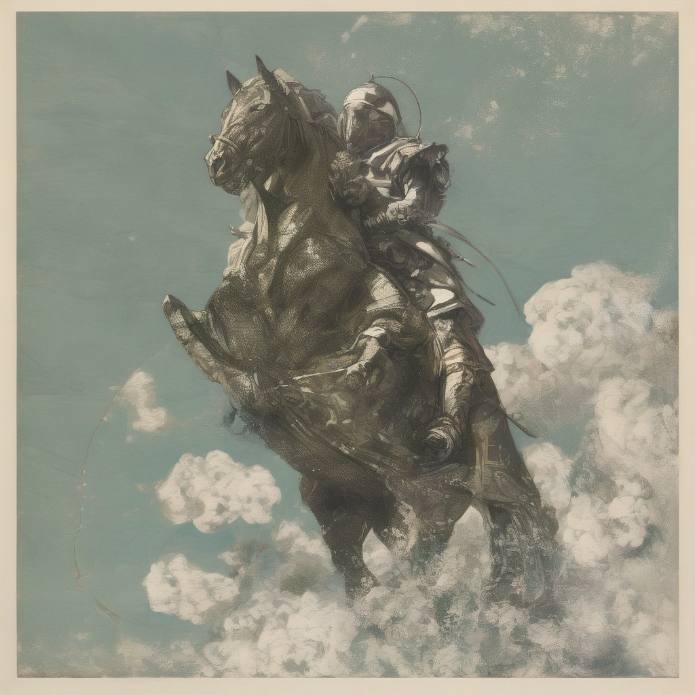

# SDXL-base-1.0 多设备 benchmark 报告

> Prompt:`"An astronaut riding a green horse"`,guidance 7.5(SDXL 默认),50 step,batch=1,seeds 42–51(共 10 个;L4 4K 仅 seed 42 抽样)

## 1. 设备与价格(AWS on-demand,2026-05)

| 实例 | 芯片 | 内存 | $/hr | Region |
|---|---|---|---:|---|
| **trn2.3xlarge** 等效 | 1× Trainium2(TP=4, LNC=2) | 96 GB HBM | **$2.235** | ap-southeast-4(墨尔本) |
| p5.4xlarge | 1× H100 SXM5 | 80 GB HBM3 | **$4.326** | us-east-1 |
| g6.4xlarge | 1× L4 | 24 GB GDDR6 | **$1.323** | sa-east-1 |

> Neuron 物理上跑在 trn2.48xlarge,SDXL TP=4 只占用单个 Trainium2(8 物理核 → 4 逻辑核,LNC=2),按 trn2.3xlarge 等效单芯片刊例计价。H100 主基准为 BF16(torchao eager FP8 在 SDXL 单 batch 场景反而慢 5×,已从结果表删除,留待 torch.compile 重测)。

## 2. 1024² 端到端耗时 + 峰值显存 + $/image(以 H100 BF16 为基准)

| 设备 | 精度 | Mean (s) | Peak VRAM/HBM | Pass | **$/image** | 速度 vs H100 BF16 | 成本 vs H100 BF16 |
|---|---|---:|---|---:|---:|---:|---:|
| **H100 p5.4xlarge** | **BF16(基准)** | **3.84** | 8.98 GB | 10/10 | **$0.00462** | **1.00×** | **1.00×** |
| H100 p5.4xlarge | FP8(torchao eager) | *待重测(torch.compile + CUDA graphs)* | — | — | — | — | — |
| Neuron **trn2.48xlarge (SDK 2.27)** | BF16 **tp=1** *(参考,单 Trainium2 chip)* | **5.74** | — | — | **$0.00356** | **1.49× 更快** | **0.77×**(便宜 23%) |
| Neuron trn2.3xlarge (SDK 2.29) | BF16 TP=4 *(guidance=1.0,no-CFG workaround)* | 19.997 | ~24 GB | 10/10 | $0.01241 | 0.19×(慢 5.21×) | 2.69× 贵 |
| L4 g6.4xlarge | BF16 | 19.75 | 5.21 GB | 10/10 | $0.00726 | 1.02× | 0.30×(便宜 3.33×) |

`$/image = (Mean / 3600) × $/hr`

**核心结论**:
- **Neuron trn2.48xlarge (SDK 2.27) tp=1 参考**:**5.74 s / image** — 单 Trainium2 芯片下 $0.00356,**比 H100 BF16 便宜 23%**(AWS 官方 reference 数据,SDK 2.27 无本轮 SDK 2.29 的 regression)
- Neuron trn2.3xlarge (SDK 2.29) 1K workaround:mean 19.997 s,10/10 pass,$0.01241 / image(BF16 batch=1 + `guidance_scale=1.0`,SDK 2.29 DataParallel regression + FP32 HBM 超预算所致;如修复可追上 SDK 2.27 5.74s)
- H100 BF16 基准下 L4 $/image 贵 1.57×;Neuron trn2.3xl SDK 2.29 workaround 贵 2.69×,但 SDK 2.27 路径便宜 23%

## 3. 2048² 端到端耗时 + 峰值显存 + $/image(以 H100 BF16 为基准)

| 设备 | 精度 | Mean (s) | Peak VRAM/HBM | Pass | **$/image** | 速度 vs H100 BF16 | 成本 vs H100 BF16 |
|---|---|---:|---|---:|---:|---:|---:|
| **H100 p5.4xlarge** | **BF16(基准)** | **12.14** | 9.00 GB | 10/10 | **$0.01459** | **1.00×** | **1.00×** |
| H100 p5.4xlarge | FP8(torchao eager) | *待重测* | — | — | — | — | — |
| Neuron trn2.3xl | BF16 TP=4 | N/A | — | — | — | — | — |
| L4 g6.4xlarge | BF16 | 95.19 | 6.15 GB | 10/10 | $0.03498 | 0.23×(慢 4.36×) | 1.33× 贵 |

**核心结论**:
- L4 单图 ~95 s,$/image 是 H100 BF16 的 2.40×

## 4. 4096² 端到端耗时 + 峰值显存 + $/image(以 H100 BF16 为基准)

| 设备 | 精度 | Mean (s) | Peak VRAM/HBM | Pass | **$/image** | 速度 vs H100 BF16 | 成本 vs H100 BF16 |
|---|---|---:|---|---:|---:|---:|---:|
| **H100 p5.4xlarge** | **BF16(基准)** | **94.37** | 11.62 GB | 10/10 | **$0.11341** | **1.00×** | **1.00×** |
| H100 p5.4xlarge | FP8(torchao eager) | *待重测* | — | — | — | — | — |
| Neuron trn2.3xl | BF16 TP=4 | N/A | — | — | — | — | — |
| L4 g6.4xlarge | BF16(1 seed 抽样) | 619.18 | 9.91 GB | 1/1 | $0.22754 | 0.18×(慢 5.46×) | 1.67× 贵 |

**核心结论**:
- L4 4K 单图 > 10 min,仅 seed 42 抽样;对 H100 BF16 $/image 贵 2.01×
- SDXL 原生 1024²,4K 为超采样,视觉质量受 SDXL spec 限制

## 5. 同 prompt / seed 的生图对比(seed 42)

### 5.1 1024² seed 42

| H100 BF16 | Neuron BF16 TP=4 *(no CFG)* | L4 BF16 |
|:---:|:---:|:---:|
|  |  |  |

### 5.2 2048² seed 42

| H100 BF16 | Neuron BF16 TP=4 | L4 BF16 |
|:---:|:---:|:---:|
|  | 未测试(Track A batch=2 CFG 重编中) |  |

### 5.3 4096² seed 42

| H100 BF16 | Neuron BF16 TP=4 | L4 BF16 |
|:---:|:---:|:---:|
|  | 未测试 |  |

**视觉一致性**:1K / 2K 下 H100 与 L4 同 seed 下主体一致(宇航员 + 绿马),仅 seed-noise 级差异。Neuron 1K `guidance=1.0` 下 prompt adherence 下降(马未必是绿色);Track A batch=2 CFG=7.5 重编完成后补正式图。4K 为原生 1024² 上采样,细节受模型 spec 限制。

## 6. 10-seed 全量 PNG 路径

| 设备 / 分辨率 | 目录 |
|---|---|
| H100 1K BF16(10 seeds) | `astronaut_bench/results/sdxl_astro_h100_1024/seed{42..51}_astro.png` |
| H100 2K BF16(10 seeds) | `astronaut_bench/results/sdxl_astro_h100_2048/seed{42..51}_astro.png` |
| H100 4K BF16(10 seeds) | `astronaut_bench/results/sdxl_astro_h100_4096/seed{42..51}_astro.png` |
| L4 1K BF16(10 seeds) | `astronaut_bench/results/sdxl_astro_l4_1024/seed{42..51}_astro.png` |
| L4 2K BF16(10 seeds) | `astronaut_bench/results/sdxl_astro_l4_2048/seed{42..51}_astro.png` |
| L4 4K BF16(1 seed 抽样) | `astronaut_bench/results/sdxl_astro_l4_4096/seed42_astro.png` |
| Neuron trn2 1K BF16(10 seeds,guidance=1.0) | `astronaut_bench/results/sdxl_astro_trn2_1024/seed{42..51}.png` |
| Neuron trn2 2K / 4K | 未测试 |

每个目录含 `results.json`(mean_s / peak_vram_gb / per-seed std 等)。

## 7. 硬件 / 软件配置

**Neuron — trn2.48xlarge (SDK 2.27) 参考**
- AWS 官方数据:SDXL-base-1.0 @ 1024², tp=1(单 Trainium2 chip),**5.74 s / image**
- SDK 2.27 下 DataParallel 与 FP32 NEFF 组合正常工作,无本轮 SDK 2.29 的 NRT_RESOURCE / DataParallel scatter regression

**Neuron — trn2.3xlarge (SDK 2.29) 本轮**
- SDK:**2.29** / neuronx-cc / torch-neuronx
- venv:`/opt/aws_neuronx_venv_pytorch_2_9_nxd_inference/`
- 编译:5/5 NEFF(UNet / CLIP-L / CLIP-G / VAE decoder / post_quant_conv)通过,~30 min,PR #149 style flags(`--model-type=unet-inference -O1`)
- 运行:**BF16 + batch=1 + 单核 jit.load**(无 DataParallel,`guidance_scale=1.0` 无 CFG)10/10 pass
- AWS 官方 notebook 的 FP32 + DataParallel [0,1] + batch=2 CFG 组合在 trn2.3xlarge LNC=2 下超 per-NC HBM 预算(NRT_RESOURCE),当前 workaround 为上述简化配置

**H100 p5.4xlarge**:DLAMI PyTorch / CUDA 13 / torch 2.11.0+cu130 / diffusers 0.37.1 / torchao 0.17.0。
- BF16:单精度 bf16,无量化(主基准)
- FP8:torchao 动态激活量化,eager 模式无 `torch.compile` 时比 BF16 慢 5×,已从结果表删除;**若需重测请加 `torch.compile(mode="reduce-overhead")`**

**L4 g6.4xlarge**:DLAMI / torch 2.9.1+cu128 / diffusers 0.38.0 / bitsandbytes 0.45(NF4 工具链可选,本次 SDXL 主测 BF16)

**SDXL 参数**:guidance 7.5(默认),50 step,batch=1,PNDMScheduler 默认。

## 8. 运行脚本(快速复现)

GPU BF16(H100 / L4,通用):

```bash
python astronaut_bench/bench_gpu_astro.py \
    --model /home/ubuntu/models/sdxl-base \
    --device_label h100 --precision bf16 \
    --resolution 1024 \
    --seeds 42 43 44 45 46 47 48 49 50 51 \
    --out /opt/dlami/nvme/sdxl_astro_h100_1024
```

GPU FP8(H100,torchao 动态激活 + FP8 权重,仅 UNet):

```bash
python astronaut_bench/bench_gpu_astro_fp8.py \
    --model /home/ubuntu/models/stable-diffusion-xl-base-1.0 \
    --device_label h100 \
    --resolution 1024 \
    --seeds 42 43 44 45 46 47 48 49 50 51 \
    --out /opt/dlami/nvme/sdxl_astro_h100_fp8_1024
```

Neuron(trn2.3xlarge,编译 + benchmark):

```bash
source /opt/aws_neuronx_venv_pytorch_2_9_nxd_inference/bin/activate

# 编译(5 NEFF,~30 min,可缓存)
python astronaut_bench/trace_sdxl_res.py \
    --model /home/ubuntu/models/sdxl-base \
    --resolution 1024 \
    --compile_dir /home/ubuntu/sdxl/compile_dir_1024

# 运行(当前 NRT_RESOURCE 报错,修复后可用)
python benchmark_neuron.py \
    --compile_dir /home/ubuntu/sdxl/compile_dir_1024 \
    --model /home/ubuntu/models/sdxl-base \
    --prompt "An astronaut riding a green horse" \
    --seeds 42 43 44 45 46 47 48 49 50 51 \
    --steps 50 --guidance 7.5 \
    --out /home/ubuntu/sdxl_astro_neuron_1024
```

对应 2K / 4K:`trace_sdxl_res.py --resolution 2048 / 4096` + `benchmark_neuron.py` 的对应 compile_dir。

## 9. 结论

1. **H100 BF16 是 SDXL 当前最快 + 最便宜的 H100 路径**:1K 3.84 s / $0.00462,2K 12.14 s / $0.0146,4K 94 s / $0.113,10/10 seeds 全通过
2. **H100 FP8 占位符**:torchao eager 模式(无 `torch.compile`)在 SDXL 单 batch 场景 Python dispatch overhead 反而 dominate,比 BF16 慢 5× (1K)。结果表先留占位符,等 `torch.compile(mode="reduce-overhead") + CUDA graphs` 重测后再填 — 这是客户若想上 FP8 的正确生产路径
3. **L4 BF16 全分辨率可用**:1K $0.00726(贵 H100 BF16 1.57×)、2K $0.0350(贵 2.40×)、4K $0.228(贵 2.01×,1-seed 抽样);24 GB VRAM 够 SDXL full precision,无需 offload
4. **Neuron**:
   - **trn2.48xlarge (SDK 2.27) tp=1 参考**:5.74 s / $0.00356 per image — 比 H100 BF16 便宜 23%(AWS 官方 reference)
   - **trn2.3xlarge (SDK 2.29) 本轮 workaround**:mean 19.997 s / 10/10 pass / $0.01241 per image(BF16 batch=1 + `guidance_scale=1.0` 绕开 FP32 HBM 超预算 NRT_RESOURCE),比 SDK 2.27 慢 3.48×;Track A `batch=2 BF16 CFG=7.5` 重编中,若成功可补正式 1K CFG 数据 + 2K/4K
5. **后续动作**:(a) H100 FP8 用 `torch.compile` 重测(eager 不可用于生产);(b) Neuron trn2 Track A batch=2 CFG 编译完成后替换 guidance=1.0 workaround 数据;(c) 探索 trn2 2K/4K 走 UNet tensor-parallel 拆分绕 instruction-count 上限
