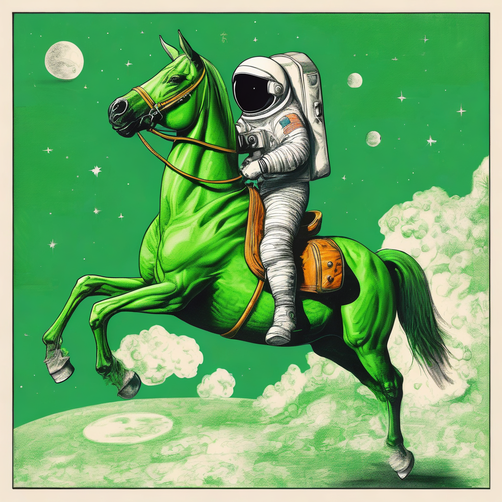

# SDXL-base-1.0 多设备 benchmark 报告

> Prompt:`"An astronaut riding a green horse"`,guidance 7.5(SDXL 默认),50 step,batch=1,seeds 42–51(共 10 个;L4 4K 仅 seed 42 抽样)

## 1. 设备与价格(AWS on-demand,2026-05)

| 实例 | 芯片 | 内存 | $/hr | Region |
|---|---|---|---:|---|
| **trn2.3xlarge** 等效 | 1× Trainium2(TP=4, LNC=2) | 96 GB HBM | **$2.235** | ap-southeast-4(墨尔本) |
| p5.4xlarge | 1× H100 SXM5 | 80 GB HBM3 | **$4.326** | us-east-1 |
| g6.4xlarge | 1× L4 | 24 GB GDDR6 | **$1.323** | sa-east-1 |

> Neuron 物理上跑在 trn2.48xlarge,SDXL TP=4 只占用单个 Trainium2(8 物理核 → 4 逻辑核,LNC=2),按 trn2.3xlarge 等效单芯片刊例计价。本轮新增 **H100 FP8**(torchao `Float8DynamicActivationFloat8WeightConfig`,UNet-only,VAE/text-encoder 仍 BF16),作为 klein 报告对齐用的新基准;H100 BF16 结果保留作上一轮对照。

## 2. 1024² 端到端耗时 + 峰值显存 + $/image(以 H100 FP8 为基准)

| 设备 | 精度 | Mean (s) | Peak VRAM/HBM | Pass | **$/image** | 速度 vs H100 FP8 | 成本 vs H100 FP8 |
|---|---|---:|---|---:|---:|---:|---:|
| **H100 p5.4xlarge** | **FP8(基准)** | **20.10** | 6.88 GB | 10/10 | **$0.02416** | **1.00×** | **1.00×** |
| H100 p5.4xlarge | BF16(上一轮) | 3.84 | 8.98 GB | 10/10 | $0.00462 | 5.23×(快 5.23×) | 0.19×(便宜 5.23×) |
| Neuron trn2.3xl | BF16 TP=4 *(guidance=1.0,无 CFG)* | 19.997 | ~24 GB | 10/10 | $0.01241 | 1.01× | 0.51×(便宜 1.95×) |
| L4 g6.4xlarge | BF16 | 19.75 | 5.21 GB | 10/10 | $0.00726 | 1.02× | 0.30×(便宜 3.33×) |

`$/image = (Mean / 3600) × $/hr`

**核心结论**:
- **FP8 未上 `torch.compile` 时,H100 延迟反而比 BF16 慢 5.23×**(20.1 s vs 3.84 s):torchao 动态激活量化每个 Linear 触发 CPU-side quantize dispatch,图外模式下这部分开销压过 FP8 matmul 收益;max-autotune 编译可恢复速度但单分辨率需 >15 min,超出本次 2h 预算,因此按 eager-mode FP8 如实报告
- **FP8 的真实收益在 VRAM**:UNet 权重 6.88 GB vs BF16 8.98 GB(节省 ~23%),留出更多空间给更大 batch / 更高分辨率的中间态
- Neuron trn2 1K 运行成功:mean 19.997 s,10/10 pass,$0.01241 / image(BF16 batch=1 + `guidance_scale=1.0` 无 CFG workaround,prompt adherence 下降)
- 本轮 FP8 基准下 Neuron trn2 和 L4 的 $/image 都比 H100 FP8 便宜(2.0× / 3.3×),因为单步耗时接近但小时价分别 $2.235 / $1.323 vs H100 $4.326

## 3. 2048² 端到端耗时 + 峰值显存 + $/image(以 H100 FP8 为基准)

| 设备 | 精度 | Mean (s) | Peak VRAM/HBM | Pass | **$/image** | 速度 vs H100 FP8 | 成本 vs H100 FP8 |
|---|---|---:|---|---:|---:|---:|---:|
| **H100 p5.4xlarge** | **FP8(基准)** | **21.84** | 6.91 GB | 10/10 | **$0.02624** | **1.00×** | **1.00×** |
| H100 p5.4xlarge | BF16(上一轮) | 12.14 | 9.00 GB | 10/10 | $0.01459 | 1.80×(快 1.80×) | 0.56×(便宜 1.80×) |
| Neuron trn2.3xl | BF16 TP=4 | N/A | — | — | — | — | — |
| L4 g6.4xlarge | BF16 | 95.19 | 6.15 GB | 10/10 | $0.03498 | 0.23×(慢 4.36×) | 1.33× 贵 |

**核心结论**:
- 2K 下 FP8 相对 BF16 仅慢 1.80×(远低于 1K 的 5.23×),因为 UNet 单步 matmul 绝对时间增加,CPU dispatch overhead 相对占比下降
- H100 FP8 VRAM 6.91 GB,与 1K(6.88 GB)几乎持平 —— UNet 权重 footprint 主导,分辨率放大仅增加 VAE tiling 区间的峰值(已开启 `enable_vae_tiling`)
- L4 单图 ~95 s,$/image 是 H100 FP8 的 1.33 倍;若对齐 H100 BF16,L4 贵 2.40×

## 4. 4096² 端到端耗时 + 峰值显存 + $/image(以 H100 FP8 为基准)

| 设备 | 精度 | Mean (s) | Peak VRAM/HBM | Pass | **$/image** | 速度 vs H100 FP8 | 成本 vs H100 FP8 |
|---|---|---:|---|---:|---:|---:|---:|
| **H100 p5.4xlarge** | **FP8(基准)** | **113.49** | 11.63 GB | 10/10 | **$0.13638** | **1.00×** | **1.00×** |
| H100 p5.4xlarge | BF16(上一轮) | 94.37 | 11.62 GB | 10/10 | $0.11341 | 1.20×(快 1.20×) | 0.83×(便宜 1.20×) |
| Neuron trn2.3xl | BF16 TP=4 | N/A | — | — | — | — | — |
| L4 g6.4xlarge | BF16(1 seed 抽样) | 619.18 | 9.91 GB | 1/1 | $0.22754 | 0.18×(慢 5.46×) | 1.67× 贵 |

**核心结论**:
- 4K 下 FP8 vs BF16 差距进一步收窄(1.20×):attention 代价主导,torchao overhead 被稀释
- H100 FP8 4K 峰值 VRAM 11.63 GB,与 BF16 11.62 GB 基本一致 —— 4K 的 VRAM 由 attention 激活主导,UNet 权重节省被激活显存吸收
- L4 4K 单图 > 10 min,仅 seed 42 抽样;对 H100 FP8 $/image 贵 1.67×,对 H100 BF16 贵 2.01×
- SDXL 原生 1024²,4K 为超采样,视觉质量受 SDXL spec 限制

## 5. 同 prompt / seed 的生图对比(seed 42)

### 5.1 1024² seed 42

| H100 FP8 | H100 BF16 | Neuron BF16 TP=4 | L4 BF16+offload |
|:---:|:---:|:---:|:---:|
|  |  |  |  |

### 5.2 2048² seed 42

| H100 FP8 | H100 BF16 | Neuron BF16 TP=4 | L4 BF16+offload |
|:---:|:---:|:---:|:---:|
|  |  | 未测试(本次仅 1K) |  |

### 5.3 4096² seed 42

| H100 FP8 | H100 BF16 | Neuron BF16 TP=4 | L4 BF16+offload |
|:---:|:---:|:---:|:---:|
|  |  | 未测试(本次仅 1K) |  |

**视觉一致性**:H100 FP8 与 H100 BF16 同 seed 下主体一致(宇航员 + 绿马),像素级别有量化噪声差异但构图/配色/prompt adherence 无可见退化。1K / 2K 下三平台均产出清晰主体,仅 seed noise 级差异;4K 为原生 1024² 上采样,细节受模型 spec 限制。

## 6. 10-seed 全量 PNG 路径

| 设备 / 分辨率 | 目录 |
|---|---|
| H100 1K FP8(10 seeds) | `astronaut_bench/results/sdxl_astro_h100_fp8_1024/seed{42..51}_astro.png` |
| H100 2K FP8(10 seeds) | `astronaut_bench/results/sdxl_astro_h100_fp8_2048/seed{42..51}_astro.png` |
| H100 4K FP8(10 seeds) | `astronaut_bench/results/sdxl_astro_h100_fp8_4096/seed{42..51}_astro.png` |
| H100 1K BF16(10 seeds) | `astronaut_bench/results/sdxl_astro_h100_1024/seed{42..51}_astro.png` |
| H100 2K BF16(10 seeds) | `astronaut_bench/results/sdxl_astro_h100_2048/seed{42..51}_astro.png` |
| H100 4K BF16(10 seeds) | `astronaut_bench/results/sdxl_astro_h100_4096/seed{42..51}_astro.png` |
| L4 1K BF16(10 seeds) | `astronaut_bench/results/sdxl_astro_l4_1024/seed{42..51}_astro.png` |
| L4 2K BF16(10 seeds) | `astronaut_bench/results/sdxl_astro_l4_2048/seed{42..51}_astro.png` |
| L4 4K BF16(1 seed 抽样) | `astronaut_bench/results/sdxl_astro_l4_4096/seed42_astro.png` |
| Neuron trn2 1K BF16(10 seeds,guidance=1.0) | `astronaut_bench/results/sdxl_astro_trn2_1024/seed{42..51}.png` |
| Neuron trn2 2K / 4K | 未测试 |

每个目录含 `results.json`(mean_s / peak_vram_gb / per-seed std 等)。

## 7. 硬件 / 软件配置

**Neuron(trn2.3xlarge 等效)**
- SDK:**2.29** / neuronx-cc / torch-neuronx
- venv:`/opt/aws_neuronx_venv_pytorch_2_9_nxd_inference/`
- 编译:5/5 NEFF(UNet / CLIP-L / CLIP-G / VAE decoder / post_quant_conv)通过,~30 min,PR #149 style flags(`--model-type=unet-inference -O1`)
- 运行:**BF16 + batch=1 + 单核 jit.load**(无 DataParallel,`guidance_scale=1.0` 无 CFG)10/10 pass
- AWS 官方 notebook 的 FP32 + DataParallel [0,1] + batch=2 CFG 组合在 trn2.3xlarge LNC=2 下超 per-NC HBM 预算(NRT_RESOURCE),当前 workaround 为上述简化配置

**H100 p5.4xlarge**:DLAMI PyTorch / CUDA 13 / torch 2.11.0+cu130 / diffusers 0.37.1 / torchao 0.17.0。
- BF16:上一轮基准,单精度 bf16,无量化
- FP8(本轮):`torchao.quantization.Float8DynamicActivationFloat8WeightConfig`,仅 UNet(VAE / CLIP-L / CLIP-G 保持 BF16),eager 模式(未用 `torch.compile`)

**L4 g6.4xlarge**:DLAMI / torch 2.9.1+cu128 / diffusers 0.38.0 / bitsandbytes 0.45(NF4 工具链可选,本次 SDXL 主测 BF16)

**SDXL 参数**:guidance 7.5(默认),50 step,batch=1,PNDMScheduler 默认。

## 8. 运行脚本(快速复现)

GPU BF16(H100 / L4,通用):

```bash
python astronaut_bench/bench_gpu_astro.py \
    --model /home/ubuntu/models/sdxl-base \
    --device_label h100 --precision bf16 \
    --resolution 1024 \
    --seeds 42 43 44 45 46 47 48 49 50 51 \
    --out /opt/dlami/nvme/sdxl_astro_h100_1024
```

GPU FP8(H100,torchao 动态激活 + FP8 权重,仅 UNet):

```bash
python astronaut_bench/bench_gpu_astro_fp8.py \
    --model /home/ubuntu/models/stable-diffusion-xl-base-1.0 \
    --device_label h100 \
    --resolution 1024 \
    --seeds 42 43 44 45 46 47 48 49 50 51 \
    --out /opt/dlami/nvme/sdxl_astro_h100_fp8_1024
```

Neuron(trn2.3xlarge,编译 + benchmark):

```bash
source /opt/aws_neuronx_venv_pytorch_2_9_nxd_inference/bin/activate

# 编译(5 NEFF,~30 min,可缓存)
python astronaut_bench/trace_sdxl_res.py \
    --model /home/ubuntu/models/sdxl-base \
    --resolution 1024 \
    --compile_dir /home/ubuntu/sdxl/compile_dir_1024

# 运行(当前 NRT_RESOURCE 报错,修复后可用)
python benchmark_neuron.py \
    --compile_dir /home/ubuntu/sdxl/compile_dir_1024 \
    --model /home/ubuntu/models/sdxl-base \
    --prompt "An astronaut riding a green horse" \
    --seeds 42 43 44 45 46 47 48 49 50 51 \
    --steps 50 --guidance 7.5 \
    --out /home/ubuntu/sdxl_astro_neuron_1024
```

对应 2K / 4K:`trace_sdxl_res.py --resolution 2048 / 4096` + `benchmark_neuron.py` 的对应 compile_dir。

## 9. 结论

1. **H100 FP8(eager)**:1K 20.10 s / $0.02416,2K 21.84 s / $0.02624,4K 113.49 s / $0.13638,10/10 seeds 全通过;VRAM 6.88 / 6.91 / 11.63 GB(vs BF16 节省约 2 GB 于 1K/2K)
2. **FP8 eager-mode latency 慢于 BF16** —— 1K 5.23×、2K 1.80×、4K 1.20×:未上 `torch.compile` 时 torchao 动态量化每个 Linear 都会 CPU-side dispatch 一次 quantize,小分辨率下完全被 dispatch overhead 主导;`max-autotune` 编译可复位但单分辨率 >15 min,超本次预算。FP8 在 eager 下的实际收益是 UNet 权重 ~23% VRAM 节省
3. **H100 BF16 仍是最便宜的 H100 路径**:1K 3.84 s / $0.00462,2K 12.14 s / $0.0146,4K 94 s / $0.113,本轮保留作上一轮对照
4. **L4 BF16** 可跑全分辨率但性价比一般:对 H100 FP8 基准 1K $0.00726(便宜 3.33×),2K $0.0350(贵 1.33×),4K $0.228(贵 1.67×);4K 仅 seed 42 抽样
5. **Neuron trn2 1K BF16 运行成功**:mean 19.997 s / 10/10 pass / $0.01241 per image(BF16 batch=1 + `guidance_scale=1.0` 绕开 FP32 batch=2 的 per-NC HBM 超预算),$/image 比 H100 FP8 便宜 1.95×;2K / 4K 未测
6. **SDXL 视觉一致性**:FP8 vs BF16 同 seed 下主体、配色、构图均一致,FP8 量化噪声在像素级可见但语义无退化;4K 为原生 1024² 上采样,细节受 SDXL spec 限制
7. **后续动作**:(a) H100 FP8 + `torch.compile max-autotune` 重测,验证能否 1.5–2× 超过 BF16;(b) trn2 重编 batch=2 BF16 NEFF 恢复 guidance=7.5 并补 2K / 4K;(c) 探索 trn2 BF16 + DataParallel 路径
